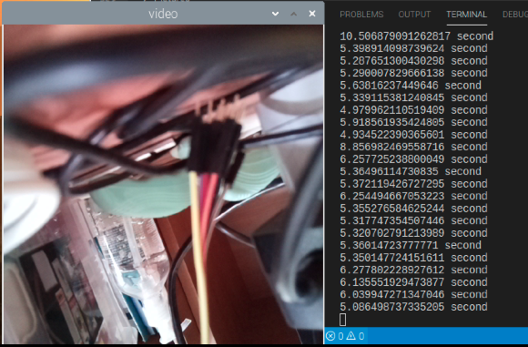

# Goal of this project

- real-time object detection with YOLOv3 or tiny yolo

## raspberry pi 4 setup command

- 가상환경
  - python3 -m venv --system-site-packages ./venv
- 가상환경 시작
  - source ./venv/bin/activate

## install command

- $ sudo apt-get update
- $ sudo apt-get upgrade
- $ sudo apt-get install libhdf5-dev libc-ares-dev libeigen3-dev
- $ sudo apt-get install libatlas-base-dev libatlas3-base
- $ sudo pip3 install h5py==2.10.0
- $ sudo pip3 install -U --user six wheel mock
- $ sudo apt-get install libgtk2.0-dev
- $ pip3 install opencv-python
- $ pip3 install opencv-contrib-python
- $ pip3 install -U numpy
- $ wget https://github.com/Qengineering/Tensorflow-Raspberry-Pi/raw/master/tensorflow-1.15.2-cp37-cp37m-linux_armv7l.whl
- $ sudo -H pip3 install tensorflow-1.15.2-cp37-cp37m-linux_armv7l.whl

## 에러

- no module named yolo3 ~~ : python 상대경로 import 문제입니다.
  - sys.path.append('~경로경로경로') 를 import 하기 전에 넣어줍니다.

## 문제

- 라즈베리파이4 8gb 이용중임에도 속도가 조금 느림을 확인
  - yolov3 로는 real-time 이 라즈베리파이 환경에서는 힘들것으로 생각됩니다.
  - 
